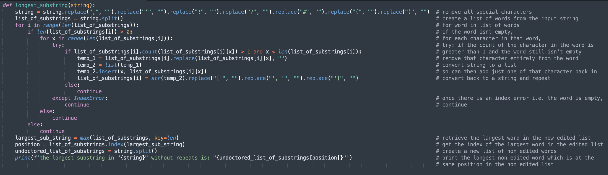
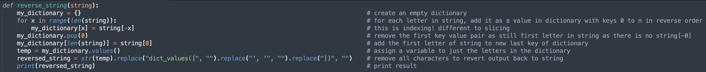
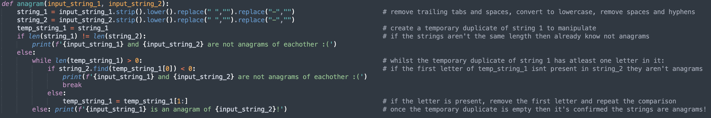
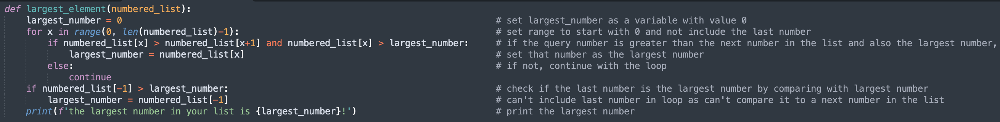
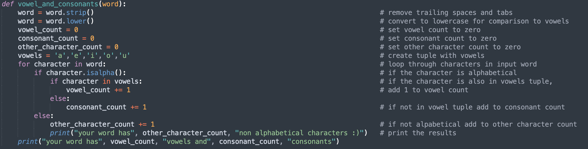
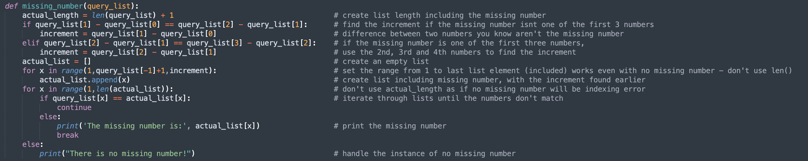
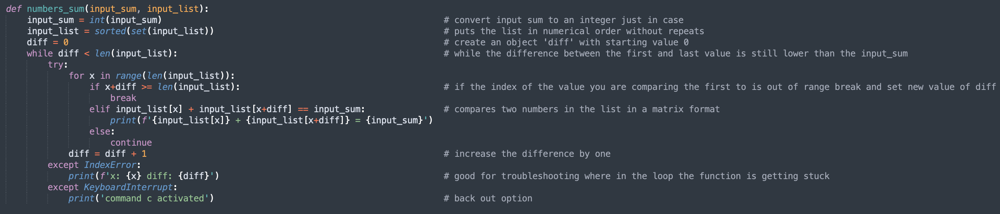

# Python
This is the repository showcasing some of my work with python :)

All functions can be found in the scripts directory above so feel free to have a go!

## Contents
- [Longest Substring](#longest_substring)
- [Reverse String](#reverse_string)
- [Anagram](#anagram)
- [Largest Element](#largest_element)
- [Vowel and Consonants](#vowel_and_consonants)
- [Missing Number](#missing_number)
- [Numbers Sum](#numbers_sum)

<a name="longest_substring"/>

## 'longest_substring' is a function I wrote that takes any length string with special characters and returns the longest substring (word) without repeating letters



example usage:
```
>>>longest_substring("This is a test string!")
the longest substring in "This is a test string" without repeats is: "string"
```

<a name="reverse_string"/>

## reverse_string() is a function I used to reverse a string without using the reverse() built in function or slicing



example usage:
```
>>> reverse_string("hello world")
'dlrow olleh'

```

<a name="anagram"/>

## before I learnt there was a sorted() function, I wrote the function anagram() to check if two strings are the anagrams of eachother



example usage:
```
>>> anagram('silent', 'listen')
silent is an anagram of listen!
>>> anagram('hello', 'world')
hello and world are not anagrams of eachother :(
```

<a name="largest_element"/>

## largest_element() is a function to find the largest number in a list of numbers



example usage:
```
>>> largest_element([4, 9, 3, 7, 2, 5, 10])
the largest number in your list is 10!
```

<a name="vowel_and_consonants"/>

## vowel_and_consonants() counts the number of vowels and consonants in a word or string, it's very useful to have the use of the isalpha() function with this one



example usage:
```
>>> vowel_and_consonants('hippopotamus!')
your word has 1 non alphabetical characters :)
your word has 5 vowels and 7 consonants
>>> vowel_and_consonants('hippopotamus')
your word has 5 vowels and 7 consonants
```

<a name="missing_number"/>

## I am particularly proud of this one, missing_number() finds the missing number of a sequence from 1 to n with a constant increment (not necessarily of 1)



example usage:
```
>>> missing_number([1, 3, 5, 7, 11, 13, 15, 17, 19, 21, 23])
The missing number is: 9
>>> missing_number([1, 3, 5, 7, 9, 11, 13, 15, 17, 19, 21, 23])
There is no missing number!
```

<a name="numbers_sum"/>

## This one challenged me! numbers_sum() takes a number and a list from the user and returns all number combinations in the list that add to that number!



example usage:
```
>>> numbers_sum("19", [8,3,5,6,7,23,42,5,7,3,9,10,5,14,13])
9 + 10 = 19
6 + 13 = 19
5 + 14 = 19
```
Note that the function doesnt also print 10 + 9 aswell as 9 + 10 which the older version was doing, also 5 is in the list three times so older versions printed 5 + 14 three times (combatted this with the set() function) and the number given by the user can be a string or float
